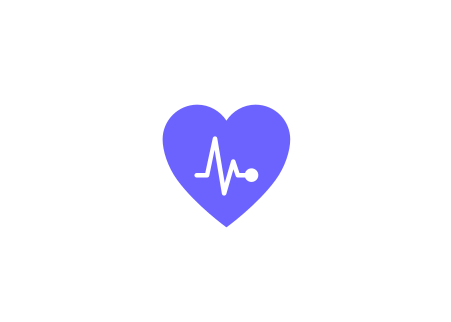
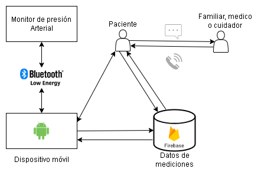
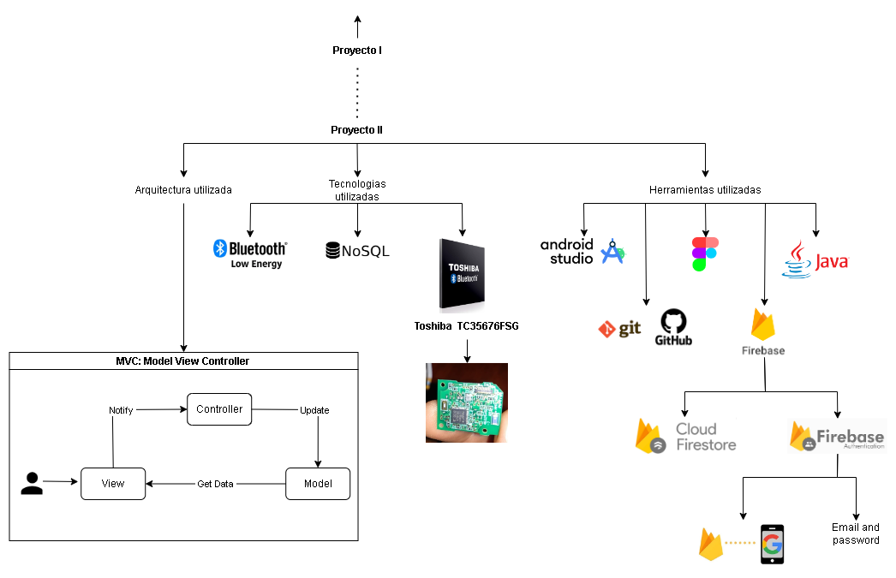
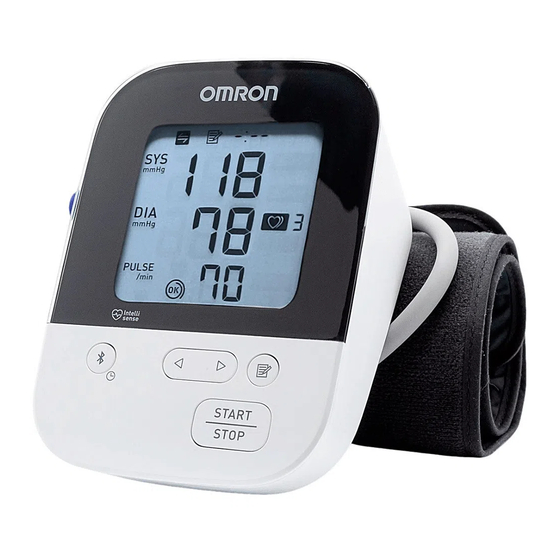

# CardioCare

  

## Summary
The project focuses on creating a mobile application that synchronizes with a portable blood pressure monitor (BPM model `Omron HEM-7156T`).

> For detailed information on the BPM model used in the project, please scroll down to the section titled "Blood Pressure Monitor (BPM) Model Used in the Project," or
[click here to view the BPM model details](#blood-pressure-monitorbpm-model-used-on-the-project).

This monitor, wirelessly connected via Bluetooth to the mobile device, will enable precise blood pressure measurements. 
The data collected by the monitor will be automatically sent to the application, where it will be stored in a remote database. 
The application, specifically designed for Android devices, will allow the user to access their blood pressure data 
in a clear and understandable manner.

  

  <em>Figure 1: Application flow of CardioCare app</em>

 A highlight of the application is its ability to identify abnormal blood pressure measurements. In case of detecting 
unusual readings, the application will activate an alert system. This feature is crucial for prompt medical intervention, 
as an abnormal reading will immediately send an SMS message to the doctor registered in the application. This immediate 
notification enables a quick and timely intervention by the healthcare professional, who will be equipped to provide the 
appropriate medical assistance to the user.

  

  <em>Figure 2: Technologies used in CardioCare app</em>

 The integration of Bluetooth technology for data transmission ensures an efficient connection between the blood pressure 
monitor and the mobile application. This seamless synchronization contributes to the accurate and automatic collection of 
data, eliminating potential human errors in information transfer.

## Splash Screen
The Splash Screen displays the initial screen when the application is starting.

  

  <em>Gif 1: Splash screen in CardioCare</em>

## Login/Signup
Users can create an account and set a password to access it. The account creation process is thorough and user-friendly, 
featuring multiple indicators to assist users in completing all required fields. If any fields are left incomplete, they 
are clearly highlighted to ensure the user is aware of what needs to be filled.

The signup process involves completing a comprehensive form with several verification fields. These fields are 
designed to ensure the accuracy and security of the user's information. Additionally, there is an option to sign up 
using a Google account for a more streamlined experience.

  

  <em>Gif 2-a: LogIn manual & with Google account</em>

  

  <em>Gif 2-b: LogUp screen</em>

## Menu Navigation
This section outlines the components of the app's hamburger menu:

 - Home
 - Profile
 - Export Data
 - Notifications
 - Language
 - Settings
 - About Us
 - Logout

  

  <em>Gif 3: Menu navigation screen in CardioCare</em>

## HomeScreen Overview
This section displays the home screen of the app, where users can view their estimated blood pressure status. The color-coded 
representation on the screen reflects the user's blood pressure health status. By pressing on the pie chart, users can access 
detailed descriptions of each color's health implications.

The card on the home screen presents the average measurement of the last 30 blood pressure readings taken over the past 30 days. 
If no measurements have been recorded in the last 30 days, the card will not display any average data. For further information 
about why the data is blank, users can click on the question icon, which provides an explanation regarding the current state 
of the information displayed on the card.

  

  <em>Gif 4: Home screen in CardioCare</em>

## Capturing Data from BPM Screen in CardioCare
To capture data from the BPM, follow these steps:

 - Press the plus sign button.
 - An initial message will appear, indicating that the app is waiting to receive a Bluetooth connection. It is crucial to follow 
the pop-up message instructions and grant the necessary permissions for the app to function correctly.
 - Once the measurement is received, the app will prompt the user to either save or discard the measurement based on their preference.

  

  <em>Gif 5-a: The capturing data screen in CardioCare shows that there is not enough information to make an estimation of the blood pressure health.</em>

  

  <em>Gif 5-b: The capturing data screen in CardioCare, with enought information to made an estimation of the blood pressure health, there is at least 30 measurements in the last 30 days.</em>

  

  <em>Gif 5-c: The capturing data screen in CardioCare, with enought information to made an estimation of the blood pressure health, SMS message was send to health professional designated by the user to be notified, in this case the health profesional is 'Gustavo 01'.</em>

## Introduction
 Woven into the very fabric of our lives, silently beating, lying within every pulse, is an undeniable reality: cardiovascular 
diseases represent a persistent shadow that haunts global health. With 20.5 million lives taken annually, conditions affecting 
the heart and blood vessels have risen as the leading cause of death worldwide, exacting an unsustainable toll in terms of 
human loss and suffering. This is an urgent wake-up call, a chrysalis enveloping the pressing need for innovative solutions.

 In this grim scenario, hypertension stands as a silent executioner, contributing substantially to the ominous statistics. 
It is not just a cold number but an enemy looming, raising its threat with each elevated beat. The reality distills into 
undeniable numbers: 10.8 million lives lost in 2019 due to hypertension, a deadly shadow that has doubled over the past three 
decades. Amidst these statistics, an urgent challenge arises: early detection and effective management of blood pressure 
stand as essential bulwarks against the onslaught of these lethal diseases.

 In this context, CardioCare is born, a technological beacon in the storm of cardiovascular diseases. It is not merely an 
application; it is the promise of a healthier tomorrow. CardioCare stands as a guardian, a digital companion that not only 
measures blood pressure but illuminates a path toward preventive care. In a world where awareness and early intervention are 
scarce, CardioCare becomes an unwavering ally, offering not just data but also hope. This project is forged on the premise 
that each measurement is an opportunity to change the course, an opportunity to prevent another heartbeat from being lost 
in the shadows of neglect.

 In the information age, technology rises as the sword against cardiovascular diseases. CardioCare is not just code and 
pixels; it is an act of resistance against the grim figures. Within its circuits and algorithms lies the possibility of a 
future where each individual, armed with knowledge and empowerment, can challenge the grip of hypertension and heart diseases.

 This is not merely a project; it is a call to action. CardioCare does not just monitor blood pressure; it is the pulse of 
hope in the fight against cardiovascular diseases. In a world where every heartbeat counts, CardioCare rises as a beacon of 
health, challenging the darkness with the light of technology committed to life.

## Justification
 Cardiovascular diseases, including hypertension, represent a significant burden on global health, being the leading cause 
of death worldwide. Early detection and continuous monitoring are crucial to effectively address these health issues. 
CardioCare positions itself as a key tool by providing users with the ability to regularly measure their blood pressure, 
securely store data, efficiently communicate with healthcare professionals, and receive automatic notifications in cases of 
abnormal measurements.

## Blood Pressure Monitor(BPM) model used on the project

  

  <em>Figure 3: Omron HEM-7156T Blood Pressure Monitor</em>

  

  <em>Figure 4: Omron HEM-7156T Packaging</em>

